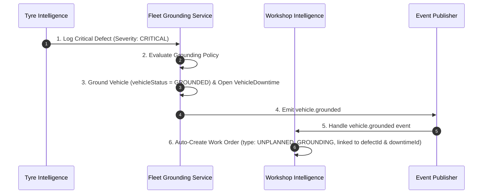
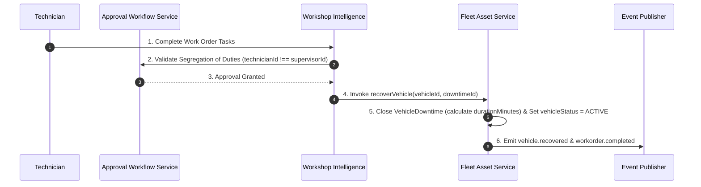

# FI360 Phase 3 — Domain Boundary & Integration Contract Specification

**Document ID**: `FI360-PHASE3-DOMAIN-BOUNDARY-CONTRACT-v1.0`  
**Date**: August 14, 2026  
**Status**: APPROVED SPECIFICATION  

---

## 1. Domain Boundary Matrix

Phase 3 introduces the **Workshop Intelligence Domain** into the FI360 modular monolith architecture. The matrix below defines strict domain boundaries, ownership, and integration rules between components:

| Bounded Context | Domain Owner | Primary Entities Owned | Allowed Inbound Invocation | Forbidden Cross-Boundary Action |
| :--- | :--- | :--- | :--- | :--- |
| **Platform Foundation** | Platform Core | `Tenant`, `Organization`, `LegalEntity`, `User`, `Driver` | Auth, Scope, Audit, Approval, Events | Modules creating custom User/Auth tables |
| **Fleet & Asset Domain** | Fleet Master | `Vehicle`, `Workshop`, `VehicleDowntime`, `VehicleGroundingPolicy`, `VehicleWorkshopAssignment` | Vehicle registration, transfer, grounding evaluation, recovery | Tyre/Workshop mutating Vehicle status directly without service call |
| **Tyre Intelligence Domain** | Tyre Master | `Tyre`, `TyrePosition`, `TyreFitment`, `TyreInspection`, `TyreDefect`, `TyreMovement` | Fitment, inspection, defect reporting | Tyre module opening downtime records directly |
| **Workshop Intelligence Domain** (PHASE 3) | Workshop Ops | `WorkOrder`, `WorkOrderTask`, `MaintenanceSchedule` | Work order creation, task assignment, quality sign-off | Workshop module mutating Vehicle master or Tyre tables directly |

---

## 2. Cross-Domain Integration Contracts

### Contract 1: Critical Tyre Defect → Grounding Policy → Workshop Work Order Creation

### Contract 2: Work Order Completion & Quality Sign-Off → Vehicle Recovery

---

## 3. Data Ownership & Foreign Key Constraints

1. **`WorkOrder.vehicleId`**: Foreign key to `vehicles.id` (Fleet Domain). Read-only reference.
2. **`WorkOrder.workshopId`**: Foreign key to `workshops.id` (Fleet Domain). Read-only reference.
3. **`WorkOrder.downtimeId`**: Optional Foreign key to `vehicle_downtimes.id` (Fleet Domain).
4. **`WorkOrder.defectId`**: Optional Foreign key to `tyre_defects.id` (Tyre Domain).
5. **`WorkOrderTask.assignedToId`**: Foreign key to `users.id` (Platform Core).

---

## 4. Architectural Rules & Guards

1. **No Direct Schema Cross-Mutations**: `WorkshopService` must update `Vehicle` state by calling `VehicleService.recoverVehicle()` rather than performing direct `prisma.vehicle.update()` queries.
2. **Event Decoupling**: Domain interactions between Tyre defect logging and Work Order creation are decoupled via domain events (`vehicle.grounded` → `WorkOrderService.handleVehicleGrounded()`).
3. **Audit Immutability**: All Work Order status transitions (`DRAFT` → `IN_PROGRESS` → `COMPLETED`) generate entries in `audit_logs`.
