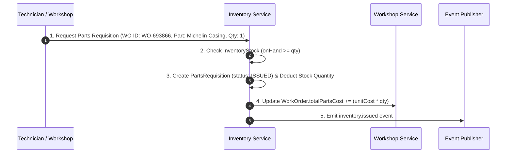
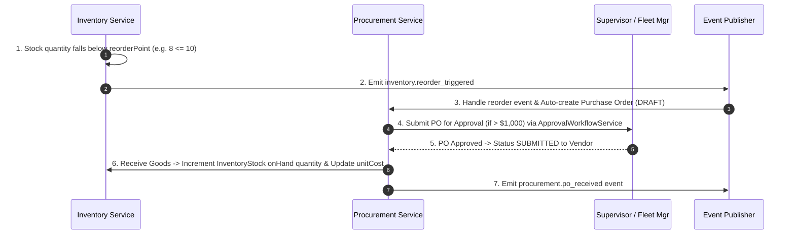

# FI360 Phase 4 — Domain Boundary & Integration Contract Specification

**Document ID**: `FI360-PHASE4-DOMAIN-BOUNDARY-CONTRACT-v1.0`  
**Date**: August 14, 2026  
**Status**: APPROVED SPECIFICATION  

---

## 1. Domain Boundary & Ownership Matrix

Phase 4 defines the **Inventory & Procurement Intelligence Domain** boundaries within the FI360 modular monolith architecture:

| Bounded Context | Domain Owner | Primary Entities Owned | Allowed Inbound Invocation | Forbidden Cross-Boundary Action |
| :--- | :--- | :--- | :--- | :--- |
| **Platform Core** | Platform | `Tenant`, `Organization`, `LegalEntity`, `User`, `Driver` | Auth, Scope, Audit, Approval, Events | Modules creating custom User or Tenant tables |
| **Fleet & Asset** | Fleet Master | `Vehicle`, `Workshop`, `VehicleDowntime`, `VehicleGroundingPolicy` | Vehicle & Workshop references | Modifying Vehicle or Workshop schemas |
| **Workshop Ops** | Workshop Ops | `WorkOrder`, `WorkOrderTask`, `MaintenanceSchedule` | Requisition parts against Work Orders | Mutating Work Order status from Inventory module |
| **Inventory & Procurement** (PHASE 4) | Supply Chain | `InventoryItem`, `InventoryStock`, `PartsRequisition`, `Vendor`, `PurchaseOrder`, `PurchaseOrderItem` | Requisitioning, stock querying, PO fulfillment | Mutating Vehicle status or Tyre fitments directly |

---

## 2. Cross-Domain Operational Integration Contracts

### Contract 1: Work Order Execution → Parts Requisition → Stock Deduction

### Contract 2: Low Stock Threshold → Automated Reorder Trigger → Purchase Order Generation

---

## 3. Foreign Key Constraints & Data Integrity Rules

1. **`InventoryStock.workshopId`**: Foreign key to `workshops.id` (Fleet Domain).
2. **`InventoryStock.itemId`**: Foreign key to `inventory_items.id`.
3. **`PartsRequisition.workOrderId`**: Foreign key to `work_orders.id` (Workshop Domain).
4. **`PartsRequisition.requestedById`**: Foreign key to `users.id` (Platform Core).
5. **`PurchaseOrder.vendorId`**: Foreign key to `vendors.id`.
6. **`PurchaseOrder.approvedById`**: Foreign key to `users.id` (Platform Core).
