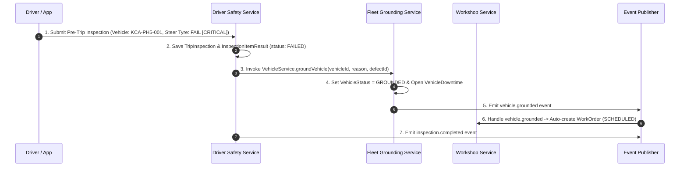

# FI360 Phase 5 — Domain Boundary & Integration Contract Specification

**Document ID**: `FI360-PHASE5-DOMAIN-BOUNDARY-CONTRACT-v1.0`  
**Date**: August 14, 2026  
**Status**: APPROVED SPECIFICATION  

---

## 1. Domain Boundary & Ownership Matrix

Phase 5 defines the **Driver & Safety Intelligence Domain** boundaries within the FI360 modular monolith architecture:

| Bounded Context | Domain Owner | Primary Entities Owned | Allowed Inbound Invocation | Forbidden Cross-Boundary Action |
| :--- | :--- | :--- | :--- | :--- |
| **Platform Core** | Platform | `Tenant`, `Organization`, `LegalEntity`, `User`, `Driver` | Auth, Scope, Audit, Approval, Events | Modules creating custom User or Driver master tables |
| **Fleet & Asset** | Fleet Master | `Vehicle`, `Workshop`, `VehicleDowntime`, `VehicleGroundingPolicy` | Vehicle status queries & grounding execution | Modifying Vehicle status directly in DB without `VehicleService` |
| **Workshop Ops** | Workshop Ops | `WorkOrder`, `WorkOrderTask`, `MaintenanceSchedule` | Auto-triggering Work Orders upon inspection grounding | Modifying Work Order schemas or bypassing sign-offs |
| **Inventory & Procurement** | Supply Chain | `InventoryItem`, `InventoryStock`, `InventoryMovement`, `PartsRequisition` | Stock queries & parts requisitions | Bypassing inventory movement ledgers |
| **Driver & Safety** (PHASE 5) | Driver & Safety | `DriverAssignment`, `TripInspection`, `InspectionItemResult`, `SafetyIncident`, `DriverSafetyScore` | Shift assignment, pre-trip digital submission, safety scoring | Directly mutating `Vehicle.vehicleStatus` without grounding service |

---

## 2. Cross-Domain Operational Integration Contracts

### Contract 1: Pre-Trip Inspection → Critical Defect Detection → Grounding & Work Order Trigger

---

## 3. Foreign Key Constraints & Data Integrity Rules

1. **`DriverAssignment.driverId`**: Foreign key to `users.id` / `drivers.id`.
2. **`DriverAssignment.vehicleId`**: Foreign key to `vehicles.id` (Fleet Domain).
3. **`TripInspection.vehicleId`**: Foreign key to `vehicles.id` (Fleet Domain).
4. **`TripInspection.driverId`**: Foreign key to `users.id` / `drivers.id`.
5. **`InspectionItemResult.inspectionId`**: Foreign key to `trip_inspections.id` (Cascade Delete).
6. **`SafetyIncident.driverId`**: Foreign key to `users.id` / `drivers.id`.
